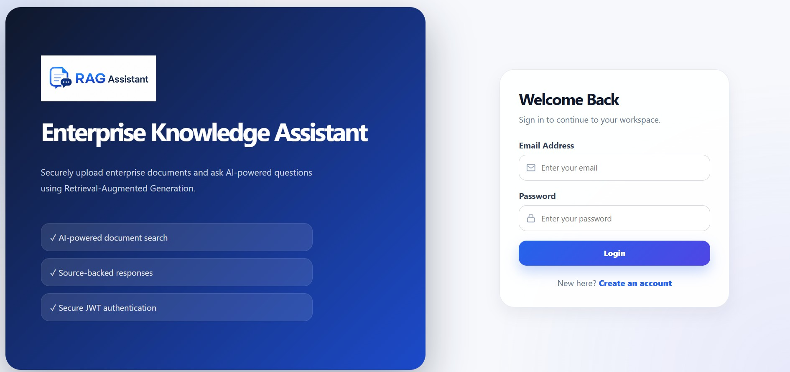
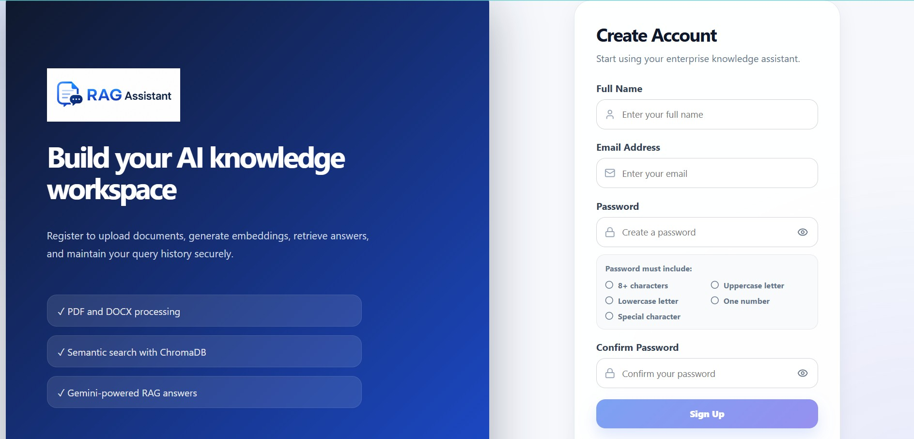
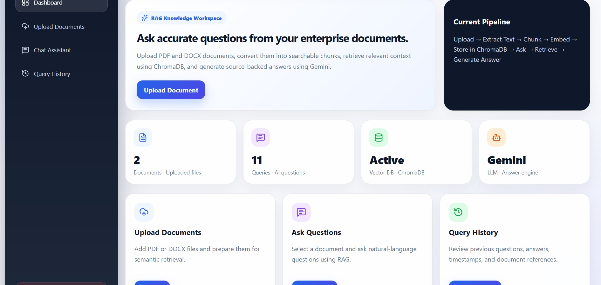
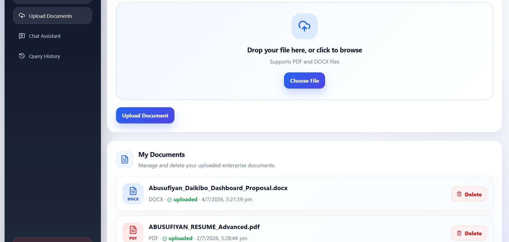
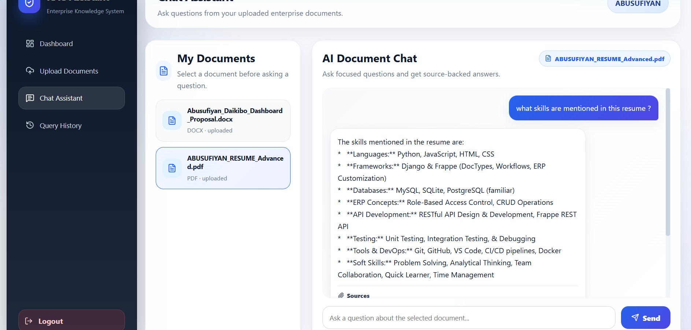
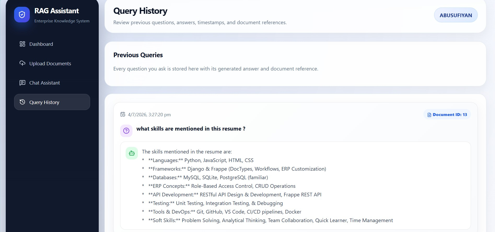
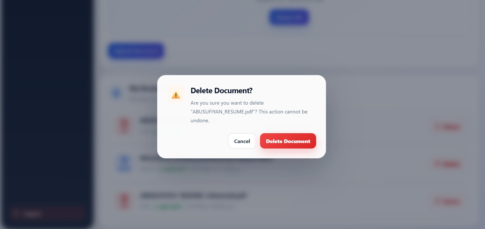
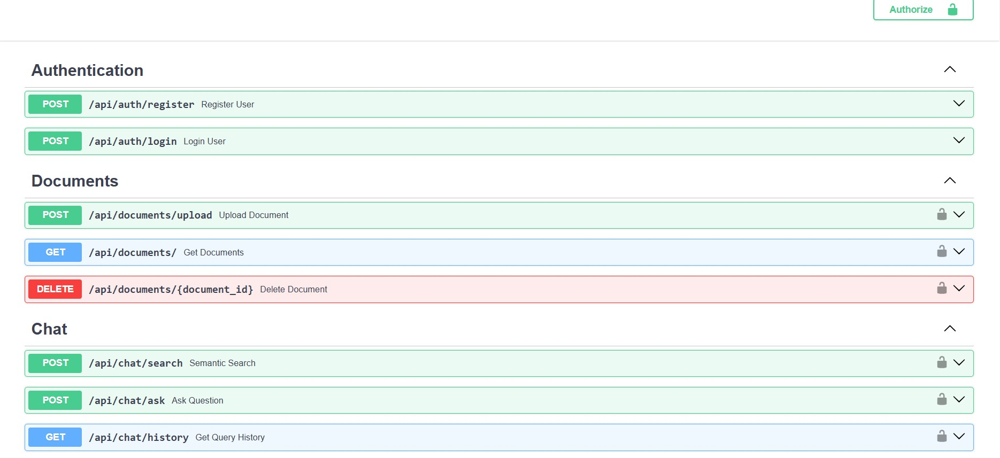

<div align="center">


# 🚀 RAG-Based Enterprise Knowledge Assistant

### Enterprise-grade AI Document Search powered by FastAPI, React, ChromaDB & Gemini AI

<p align="center">


</p>

### 🧠 AI-Powered Enterprise Knowledge Retrieval using Retrieval-Augmented Generation

Upload PDF/DOCX documents, generate semantic embeddings, search through vector databases, and receive accurate AI-generated answers backed by source references.

</div>

---

## 🌐 Live Links

- **Live Demo:** https://rag-enterprise-knowledge-assistant.vercel.app
- **Backend API:** https://rag-enterprise-knowledge-assistant-api.onrender.com
- **API Documentation:** https://rag-enterprise-knowledge-assistant-api.onrender.com/docs
- **Demo Video:** [Watch Demo](frontend/src/assets/screenshots/demo_video.mp4)

---

## ✨ Project Overview

Traditional keyword-based search systems often fail to understand natural language queries across large enterprise documents.

This project solves that challenge by implementing a complete **Retrieval-Augmented Generation (RAG)** pipeline.

The assistant retrieves the most relevant document chunks from ChromaDB and then sends that context to Gemini AI to generate accurate, source-backed answers.

---

## 🎯 Key Features

### 🔐 Authentication

- User Registration
- User Login
- JWT Authentication
- Password Hashing using bcrypt
- Protected Routes
- Frontend and Backend Validation

### 📄 Document Management

- Upload PDF Documents
- Upload DOCX Documents
- Automatic Text Extraction
- Metadata Storage
- Document Listing
- Document Deletion
- Upload Validation

### 🧠 AI Processing

- Text Chunking
- Gemini Embedding API
- ChromaDB Vector Storage
- Semantic Similarity Search
- Context Retrieval
- Gemini 2.5 Flash Answer Generation
- Source-backed AI Responses

### 💬 Chat Assistant

- Natural Language Questions
- AI-generated Answers
- Source References
- Loading Indicators
- Auto Scroll
- Document Selection
- Premium Chat Interface

### 📜 Query History

- Previous Questions
- AI Responses
- Timestamp Tracking
- User-wise History
- Clean History Interface

---

## 🛠 Tech Stack

| Category | Technology |
|-----------|------------|
| Frontend | React.js + Vite |
| Backend | FastAPI |
| Database | PostgreSQL / Neon |
| Vector Database | ChromaDB |
| ORM | SQLAlchemy |
| Authentication | JWT + Passlib bcrypt |
| Embedding Model | Gemini Embedding API |
| LLM | Google Gemini 2.5 Flash |
| Styling | CSS3 |
| Icons | Lucide React |
| HTTP Client | Axios |
| Deployment | Vercel + Render |

---

## 📸 Application Screenshots

### 🔐 Login



### 📝 Register



### 📊 Dashboard



### 📂 Document Upload



### 🤖 AI Chat Assistant



### 📜 Query History



### 🗑 Delete Confirmation



### 📘 Swagger API Documentation



---

## 🏗 System Architecture

```text
User
 │
 ▼
React Frontend (Vercel)
 │
 ▼
FastAPI Backend (Render)
 │
 ├── PostgreSQL / Neon
 │
 ├── Gemini Embedding API
 │
 ├── ChromaDB Vector Store
 │
 └── Gemini 2.5 Flash
 │
 ▼
AI Generated Answer + Source References
```

---

## 🔄 RAG Pipeline

```text
Upload PDF / DOCX
        │
        ▼
Extract Text
        │
        ▼
Split Text into Chunks
        │
        ▼
Generate Embeddings using Gemini Embedding API
        │
        ▼
Store Embeddings in ChromaDB
        │
        ▼
User asks a Question
        │
        ▼
Generate Question Embedding
        │
        ▼
Semantic Similarity Search
        │
        ▼
Retrieve Relevant Chunks
        │
        ▼
Send Context + Question to Gemini
        │
        ▼
Generate Final Answer
        │
        ▼
Return Answer with Source References
```

---

## 📂 Project Structure

```text
rag-enterprise-knowledge-assistant
│
├── backend/
│   ├── app/
│   │   ├── routes/
│   │   ├── services/
│   │   ├── auth.py
│   │   ├── config.py
│   │   ├── database.py
│   │   ├── main.py
│   │   ├── models.py
│   │   └── schemas.py
│   │
│   ├── uploads/
│   ├── chroma_db/
│   ├── requirements.txt
│   ├── runtime.txt
│   └── .env.example
│
├── frontend/
│   ├── public/
│   │   └── favicon.png
│   │
│   ├── src/
│   │   ├── api/
│   │   ├── assets/
│   │   │   ├── logo.png
│   │   │   ├── favicon.png
│   │   │   └── screenshots/
│   │   ├── components/
│   │   ├── pages/
│   │   ├── services/
│   │   ├── styles/
│   │   ├── App.jsx
│   │   ├── index.css
│   │   └── main.jsx
│   │
│   ├── index.html
│   ├── package.json
│   └── vite.config.js
│
├── .gitignore
└── README.md
```

---

## 🚀 Getting Started

### 📋 Prerequisites

Before running the project, make sure you have the following installed:

- Python 3.11+
- Node.js 20+
- PostgreSQL (or Neon PostgreSQL)
- Git
- Google Gemini API Key

---

# ⚙ Backend Setup

Clone the repository

```bash
git clone https://github.com/abusufiyan7518/rag-enterprise-knowledge-assistant.git

cd rag-enterprise-knowledge-assistant/backend
```

Create a virtual environment

```bash
python -m venv venv
```

Activate virtual environment

### Windows

```bash
venv\Scripts\activate
```

### Linux / macOS

```bash
source venv/bin/activate
```

Install dependencies

```bash
pip install -r requirements.txt
```

Create a `.env` file

```env
DATABASE_URL=

SECRET_KEY=

ALGORITHM=HS256

ACCESS_TOKEN_EXPIRE_MINUTES=60

GEMINI_API_KEY=

GEMINI_MODEL=gemini-2.5-flash
```

Run backend

```bash
uvicorn app.main:app --reload
```

Backend URL

```text
http://127.0.0.1:8000
```

Swagger Documentation

```text
http://127.0.0.1:8000/docs
```

---

# 💻 Frontend Setup

Open another terminal

```bash
cd frontend
```

Install packages

```bash
npm install
```

Create `.env`

```env
VITE_API_BASE_URL=http://127.0.0.1:8000
```

Run frontend

```bash
npm run dev
```

Frontend URL

```text
http://localhost:5173
```

---

# 🔑 Environment Variables

## Backend

| Variable | Description |
|-----------|-------------|
| DATABASE_URL | PostgreSQL / Neon Database URL |
| SECRET_KEY | JWT Secret Key |
| ALGORITHM | JWT Algorithm |
| ACCESS_TOKEN_EXPIRE_MINUTES | JWT Token Expiry |
| GEMINI_API_KEY | Google Gemini API Key |
| GEMINI_MODEL | Gemini Model |

---

## Frontend

| Variable | Description |
|-----------|-------------|
| VITE_API_BASE_URL | Backend Base URL |

---

# 🔌 REST API Endpoints

## Authentication

| Method | Endpoint | Description |
|----------|----------|-------------|
| POST | `/api/auth/register` | Register a new user |
| POST | `/api/auth/login` | Login user |

---

## Documents

| Method | Endpoint | Description |
|----------|----------|-------------|
| GET | `/api/documents/` | List uploaded documents |
| POST | `/api/documents/upload` | Upload PDF/DOCX |
| DELETE | `/api/documents/{id}` | Delete document |

---

## Chat

| Method | Endpoint | Description |
|----------|----------|-------------|
| POST | `/api/chat/ask` | Ask question |
| GET | `/api/chat/history` | Fetch query history |

---

# 📦 Main Dependencies

## Backend

- FastAPI
- SQLAlchemy
- PostgreSQL
- ChromaDB
- Google Gemini AI
- Passlib (bcrypt)
- Python JOSE (JWT)
- Python Multipart
- PyMuPDF
- Python DOCX

---

## Frontend

- React
- Vite
- React Router DOM
- Axios
- React Hot Toast
- Lucide React

---

# 🔒 Security Features

- JWT Authentication
- Password Hashing (bcrypt)
- Protected API Routes
- Protected Frontend Routes
- User-wise Document Isolation
- User-wise Query History
- Backend Validation
- Frontend Validation
- Secure Environment Variables
- Secure API Responses

---

# ⚡ Performance Optimizations

- Vector Similarity Search
- ChromaDB Persistent Storage
- Gemini Embedding API
- Context-based Retrieval
- Optimized React Components
- Reusable UI Components
- Auto Scroll Chat
- Loading Indicators
- Responsive Layout

---

# 🧪 Tested Features

- ✅ User Registration
- ✅ User Login
- ✅ Form Validation
- ✅ JWT Authentication
- ✅ Protected Routes
- ✅ PDF Upload
- ✅ DOCX Upload
- ✅ Document Listing
- ✅ Document Deletion
- ✅ Semantic Search
- ✅ Gemini AI Responses
- ✅ Source References
- ✅ Query History
- ✅ Responsive UI
- ✅ Production Deployment

---

# 🚀 Deployment

| Layer | Platform |
|--------|----------|
| Frontend | Vercel |
| Backend | Render |
| Database | Neon PostgreSQL |
| Vector Database | ChromaDB |

---

# 🛣 Roadmap

The following features are planned for future releases.

- Multi-document semantic search
- Conversation memory
- Streaming AI responses
- Drag & Drop document upload
- OCR support for scanned PDFs
- Role-Based Access Control (RBAC)
- Admin Dashboard
- User Profile Management
- Docker Deployment
- CI/CD Pipeline (GitHub Actions)
- Unit & Integration Testing
- Cloud Object Storage (AWS S3)
- AI-generated Document Summaries
- Multi-language Document Support
- Export Chat Conversations

---

# 📈 Learning Outcomes

This project helped strengthen practical knowledge in:

- Retrieval-Augmented Generation (RAG)
- FastAPI Backend Development
- React Frontend Development
- REST API Development
- JWT Authentication
- PostgreSQL Database Design
- SQLAlchemy ORM
- ChromaDB Vector Database
- Google Gemini API
- Gemini Embedding API
- Semantic Search
- Prompt Engineering
- Production Deployment
- Full Stack Application Development
- Modern Software Architecture
- Secure Authentication
- Responsive UI Design
- Error Handling & Validation

---

# 🤝 Contributing

Contributions are welcome!

If you'd like to improve this project:

1. Fork the repository

2. Create a new branch

```bash
git checkout -b feature/your-feature
```

3. Commit your changes

```bash
git commit -m "Add new feature"
```

4. Push the branch

```bash
git push origin feature/your-feature
```

5. Open a Pull Request

---

# 📄 License

This project is licensed under the **MIT License**.

Feel free to use this project for educational and learning purposes.

---

# 👨‍💻 Author

## Abusufiyan

**Python Backend Developer | MCA Student**

Passionate about building scalable backend systems, AI-powered applications, REST APIs, and enterprise software using Python.

### 📫 Connect with Me

- **GitHub:** https://github.com/abusufiyan7518
- **LinkedIn:** https://www.linkedin.com/in/abusufiyan-822b9827b/
- **Email:** abusufiyantechsak@gmail.com

---

# 🌟 Project Highlights

- ✅ Enterprise-grade Authentication
- ✅ Secure JWT Authorization
- ✅ Google Gemini AI Integration
- ✅ Gemini Embedding API
- ✅ ChromaDB Vector Search
- ✅ Retrieval-Augmented Generation (RAG)
- ✅ Semantic Search
- ✅ PDF & DOCX Processing
- ✅ Query History
- ✅ Source-backed AI Responses
- ✅ Responsive React UI
- ✅ Production Deployment
- ✅ Clean Project Architecture

---

# 🙏 Acknowledgements

Special thanks to the amazing technologies and communities behind this project:

- Google Gemini AI
- FastAPI
- React
- PostgreSQL
- Neon
- ChromaDB
- SQLAlchemy
- Vercel
- Render
- Lucide React
- Open Source Community

---

# ⭐ Support

If you found this project useful,

please consider giving it a ⭐ on GitHub.

It motivates me to continue building and sharing high-quality open-source projects.

---

<div align="center">

## 🚀 Built with ❤️ using FastAPI, React, ChromaDB & Gemini AI

### Designed & Developed by Abusufiyan

### ⭐ Thanks for visiting this repository!


</div>