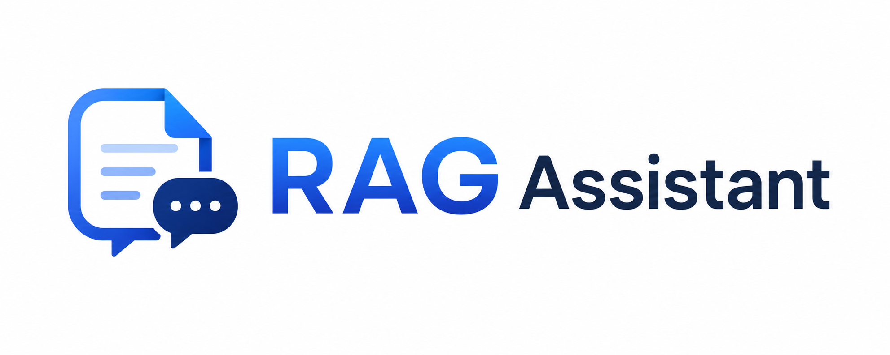

<div align="center">



# 🚀 RAG-Based Enterprise Knowledge Assistant

### Enterprise-grade AI Document Search powered by FastAPI, React, ChromaDB & Gemini AI

<p align="center">


</p>

---

### 🧠 AI-Powered Enterprise Knowledge Retrieval using Retrieval-Augmented Generation (RAG)

Upload enterprise documents, generate semantic embeddings, search through vector databases, and receive accurate AI-generated answers backed by source citations.

</div>

---

# ✨ Project Overview

Traditional keyword-based search systems often fail to understand natural language queries across large enterprise documents.

This project solves that challenge by implementing a complete **Retrieval-Augmented Generation (RAG)** pipeline.

Instead of allowing the language model to answer from its own knowledge, the assistant first retrieves the most relevant document chunks from a vector database and then generates responses strictly from that retrieved context.

This significantly improves answer accuracy while reducing hallucinations.

---

# 🎯 Key Features

## 🔐 Authentication

- Secure User Registration
- JWT Authentication
- Password Hashing using bcrypt
- Protected Routes
- Session Management

---

## 📄 Document Management

- Upload PDF Documents
- Upload DOCX Documents
- Automatic Text Extraction
- Metadata Storage
- Document Listing
- Document Deletion
- Upload Validation

---

## 🧠 AI Processing

- Intelligent Text Chunking
- Sentence Transformer Embeddings
- ChromaDB Vector Storage
- Semantic Similarity Search
- Context Retrieval
- Gemini 2.5 Flash Integration
- Source-backed AI Responses

---

## 💬 Chat Assistant

- Natural Language Questions
- AI Generated Answers
- Source Citations
- Loading Indicators
- Auto Scroll
- Document Selection
- Premium Chat Interface

---

## 📜 Query History

- Previous Questions
- AI Responses
- Timestamp Tracking
- User-wise History
- Clean History Interface

---

## 🎨 Frontend Features

- Modern Dashboard
- Premium UI Design
- Responsive Layout
- Toast Notifications
- Loading Animations
- Empty States
- Confirmation Modals
- Lucide React Icons
- Protected Navigation

---

# 🛠 Tech Stack

| Category | Technology |
|-----------|------------|
| Frontend | React.js + Vite |
| Backend | FastAPI |
| Database | PostgreSQL |
| Vector Database | ChromaDB |
| ORM | SQLAlchemy |
| Authentication | JWT + Passlib (bcrypt) |
| Embedding Model | Sentence Transformers (all-MiniLM-L6-v2) |
| Large Language Model | Google Gemini 2.5 Flash |
| Styling | CSS3 |
| Icons | Lucide React |
| HTTP Client | Axios |

---

# 📸 Application Screenshots

## 🔐 Login

<p align="center">

</p>

Modern and secure authentication interface with JWT-based login, responsive design, toast notifications, and enterprise branding.

---

## 📝 Register

<p align="center">

</p>

User registration with input validation, password encryption, clean UI, and secure account creation.

---

## 📊 Dashboard

<p align="center">

</p>

A premium dashboard providing quick insights into uploaded documents, query history, AI engine status, and navigation to core modules.

---

## 📂 Document Upload

<p align="center">

</p>

Upload PDF or DOCX files, automatically extract text, generate embeddings, and store vectors inside ChromaDB.

---

## 🤖 AI Chat Assistant

<p align="center">

</p>

Ask natural language questions about uploaded documents and receive accurate AI-generated responses with source citations.

---

## 📜 Query History

<p align="center">

</p>

Review previously asked questions along with generated answers and timestamps.

---

## 🗑 Delete Confirmation

<p align="center">

</p>

Professional confirmation modal prevents accidental document deletion and improves user experience.

---

# 🏗 System Architecture

```text
                     User
                       │
                       ▼
        ┌──────────────────────────┐
        │ React Frontend (Vite)    │
        └──────────────────────────┘
                       │
                  Axios API Calls
                       │
                       ▼
        ┌──────────────────────────┐
        │ FastAPI Backend          │
        └──────────────────────────┘
                       │
         ┌─────────────┴─────────────┐
         │                           │
         ▼                           ▼
 PostgreSQL                     ChromaDB
(User Data)                 (Vector Embeddings)
         │                           ▲
         │                           │
         │                 Sentence Transformers
         │                 all-MiniLM-L6-v2
         │                           │
         └─────────────┬─────────────┘
                       ▼
              Relevant Chunks
                       │
                       ▼
              Google Gemini AI
                       │
                       ▼
              AI Generated Answer
                       │
                       ▼
                 Source References
```

---

# 🔄 RAG Pipeline

```text
Upload PDF / DOCX
        │
        ▼
Extract Text
        │
        ▼
Split into Chunks
        │
        ▼
Generate Embeddings
        │
        ▼
Store in ChromaDB
        │
        ▼
─────────────────────────────────────
User asks a Question
        │
        ▼
Generate Question Embedding
        │
        ▼
Semantic Similarity Search
        │
        ▼
Retrieve Top Relevant Chunks
        │
        ▼
Send Context + Question
        │
        ▼
Google Gemini
        │
        ▼
Final AI Response
        │
        ▼
Return Source References
```

---

# 📂 Project Structure

# 📂 Project Structure

```text
RAG-Based-Enterprise-Knowledge-Assistant
│
├── backend/
│   ├── app/
│   │   ├── routes/
│   │   ├── services/
│   │   ├── models.py
│   │   ├── schemas.py
│   │   ├── database.py
│   │   ├── auth.py
│   │   └── main.py
│   │
│   ├── uploads/
│   ├── chroma_db/
│   ├── requirements.txt
│   └── .env
│
├── frontend/
│   ├── public/
│   │   └── favicon.png
│   │
│   ├── src/
│   │   ├── api/
│   │   │   └── axios.js
│   │   │
│   │   ├── assets/
│   │   │   ├── logo.png
│   │   │   ├── favicon.png
│   │   │   └── screenshots/
│   │   │       ├── login.jpg
│   │   │       ├── register.jpg
│   │   │       ├── dashboard.jpg
│   │   │       ├── uploadDocument.jpg
│   │   │       ├── chatAssistant.jpg
│   │   │       ├── queryHistory.jpg
│   │   │       └── deleteConfirmation.jpg
│   │   │
│   │   ├── components/
│   │   │   ├── ConfirmModal.jsx
│   │   │   ├── DocumentList.jsx
│   │   │   ├── Layout.jsx
│   │   │   ├── LoadingSpinner.jsx
│   │   │   └── ProtectedRoute.jsx
│   │   │
│   │   ├── pages/
│   │   │   ├── Chat.jsx
│   │   │   ├── Dashboard.jsx
│   │   │   ├── History.jsx
│   │   │   ├── Login.jsx
│   │   │   ├── NotFound.jsx
│   │   │   ├── Register.jsx
│   │   │   └── Upload.jsx
│   │   │
│   │   ├── services/
│   │   │   ├── authService.js
│   │   │   ├── chatService.js
│   │   │   └── documentService.js
│   │   │
│   │   ├── styles/
│   │   │   ├── auth.css
│   │   │   ├── chat.css
│   │   │   ├── dashboard.css
│   │   │   ├── history.css
│   │   │   ├── layout.css
│   │   │   ├── loading.css
│   │   │   ├── modal.css
│   │   │   └── notfound.css
│   │   │
│   │   ├── App.jsx
│   │   ├── index.css
│   │   └── main.jsx
│   │
│   ├── index.html
│   ├── package.json
│   ├── package-lock.json
│   └── vite.config.js
│
├── .gitignore
└── README.md
```

---

# ⚙ Core Modules

| Module | Description |
|----------|-------------|
| Authentication | JWT-based secure login and registration |
| Document Upload | Upload and process PDF/DOCX files |
| Text Processing | Extract and chunk document content |
| Embedding Engine | Generate semantic embeddings |
| Vector Database | Store embeddings in ChromaDB |
| Semantic Search | Retrieve relevant document chunks |
| Gemini Integration | Generate context-aware answers |
| Query History | Store and display previous conversations |
| Dashboard | Monitor documents and application usage |

# 🚀 Getting Started

Follow the steps below to run the project locally.

---

# 📋 Prerequisites

Before starting, ensure the following software is installed on your system.

- Python 3.11+
- Node.js 20+
- PostgreSQL
- Git
- Google Gemini API Key

---

# ⚙ Backend Setup

Clone the repository:

```bash
git clone https://github.com/abusufiyan7518/rag-enterprise-knowledge-assistant.git

cd RAG-Based-Enterprise-Knowledge-Assistant/backend
```

Create a virtual environment:

```bash
python -m venv venv
```

Activate the virtual environment

### Windows

```bash
venv\Scripts\activate
```

### Linux / macOS

```bash
source venv/bin/activate
```

Install dependencies

```bash
pip install -r requirements.txt
```

Create a `.env` file inside the backend folder.

Example:

```env
DATABASE_URL=

SECRET_KEY=

ALGORITHM=HS256

ACCESS_TOKEN_EXPIRE_MINUTES=60

GEMINI_API_KEY=

GEMINI_MODEL=gemini-2.5-flash
```

Run the backend server

```bash
uvicorn app.main:app --reload
```

Backend will be available at

```
http://127.0.0.1:8000
```

Swagger Documentation

```
http://127.0.0.1:8000/docs
```

---

# 💻 Frontend Setup

Open a new terminal.

```bash
cd frontend
```

Install dependencies

```bash
npm install
```

Create a `.env` file inside the frontend folder.

Example

```env
VITE_API_BASE_URL=http://127.0.0.1:8000
```

Start the frontend

```bash
npm run dev
```

Application

```
http://localhost:5173
```

---

# 🔑 Environment Variables

## Backend

| Variable | Description |
|-----------|-------------|
| DATABASE_URL | PostgreSQL Connection String |
| SECRET_KEY | JWT Secret Key |
| ALGORITHM | JWT Algorithm |
| ACCESS_TOKEN_EXPIRE_MINUTES | JWT Expiry Time |
| GEMINI_API_KEY | Google Gemini API Key |
| GEMINI_MODEL | Gemini Model Name |

---

## Frontend

| Variable | Description |
|-----------|-------------|
| VITE_API_BASE_URL | Backend Base URL |

---

# 🔌 REST API Endpoints

## Authentication

| Method | Endpoint | Description |
|----------|----------|-------------|
| POST | `/api/auth/register` | Register a new user |
| POST | `/api/auth/login` | Login user |

---

## Documents

| Method | Endpoint | Description |
|----------|----------|-------------|
| GET | `/api/documents` | List uploaded documents |
| POST | `/api/documents/upload` | Upload PDF or DOCX |
| DELETE | `/api/documents/{id}` | Delete document |

---

## AI Chat

| Method | Endpoint | Description |
|----------|----------|-------------|
| POST | `/api/chat/ask` | Ask a question |
| GET | `/api/chat/history` | Fetch query history |

---

# 📦 Main Dependencies

## Backend

- FastAPI
- SQLAlchemy
- PostgreSQL
- ChromaDB
- Sentence Transformers
- Passlib (bcrypt)
- PyJWT
- Python Multipart
- Google Generative AI

---

## Frontend

- React
- Vite
- React Router DOM
- Axios
- React Hot Toast
- Lucide React

---

# 🔒 Security Features

- JWT Authentication
- Password Hashing using bcrypt
- Protected Routes
- User-wise Document Isolation
- User-wise Query History
- Environment Variables
- Input Validation
- Secure API Responses

---

# ⚡ Performance Optimizations

- Semantic Vector Search
- Chunk-based Retrieval
- Optimized React Components
- Auto Scroll Chat
- Loading Skeletons
- Lazy UI Rendering
- Toast Notifications
- Reusable Components
- Responsive Layout

---

# 🧪 Tested Features

- ✅ User Registration
- ✅ User Login
- ✅ JWT Authentication
- ✅ Protected Routes
- ✅ Upload PDF
- ✅ Upload DOCX
- ✅ Delete Documents
- ✅ Semantic Search
- ✅ Gemini Responses
- ✅ Source References
- ✅ Query History
- ✅ Responsive UI
- ✅ Production Build

# 🚀 Deployment

The application can be deployed using the following platforms.

## Frontend

- Vercel
- Netlify

## Backend

- Render
- Railway

## Database

- PostgreSQL (Render / Railway / Supabase)

## Vector Database

- ChromaDB

---

# 🛣 Roadmap

The following features are planned for future releases.

- Multi-document semantic search
- Conversation memory
- Streaming AI responses
- Role-based access control (RBAC)
- Admin dashboard
- User profile management
- Drag & Drop document upload
- OCR support for scanned PDFs
- Docker containerization
- CI/CD pipeline
- Unit & Integration Testing
- Cloud object storage (AWS S3)
- Multi-language document support
- Export chat conversations
- AI-generated document summaries

---

# 📊 Project Highlights

✔ Enterprise Authentication

✔ JWT Protected Routes

✔ PDF & DOCX Support

✔ Semantic Search

✔ ChromaDB Vector Database

✔ Sentence Transformer Embeddings

✔ Google Gemini Integration

✔ Source-backed AI Responses

✔ Query History

✔ Modern React Dashboard

✔ Premium UI/UX

✔ Responsive Design

✔ Production Ready Architecture

---

# 📈 Learning Outcomes

This project helped strengthen practical knowledge in:

- Retrieval-Augmented Generation (RAG)
- FastAPI Backend Development
- React Frontend Development
- JWT Authentication
- SQLAlchemy ORM
- PostgreSQL
- ChromaDB
- Sentence Transformers
- Google Gemini API
- REST API Design
- Component-based UI Development
- Secure Application Development
- Modern Software Architecture

---

# 🤝 Contributing

Contributions are welcome.

If you'd like to improve this project:

1. Fork the repository

2. Create your feature branch

```bash
git checkout -b feature/new-feature
```

3. Commit your changes

```bash
git commit -m "Add new feature"
```

4. Push to your branch

```bash
git push origin feature/new-feature
```

5. Open a Pull Request

---

# 📄 License

This project is licensed under the **MIT License**.

Feel free to use this project for educational and learning purposes.

---

# 👨‍💻 Author

## Abusufiyan

**Python Backend Developer | MCA Student**

Passionate about building scalable backend systems, AI-powered applications, REST APIs, and enterprise software using Python.

### Connect with me

- GitHub: https://github.com/abusufiyan7518
- LinkedIn: https://www.linkedin.com/in/abusufiyan-822b9827b/
- Email: abusufiyantechsak@gmail.com

---

# ⭐ Support

If you found this project useful,

please consider giving it a ⭐ on GitHub.

It helps others discover the project and motivates future improvements.

---

# 🙏 Acknowledgements

Special thanks to:

- Google Gemini AI
- FastAPI
- ChromaDB
- Sentence Transformers
- React
- PostgreSQL
- Lucide React
- Open Source Community

---

<div align="center">

## 🚀 Built with FastAPI, React, ChromaDB & Gemini AI

### Designed & Developed by ABUSUFIYAN

⭐ Thank you for visiting this repository.

</div>